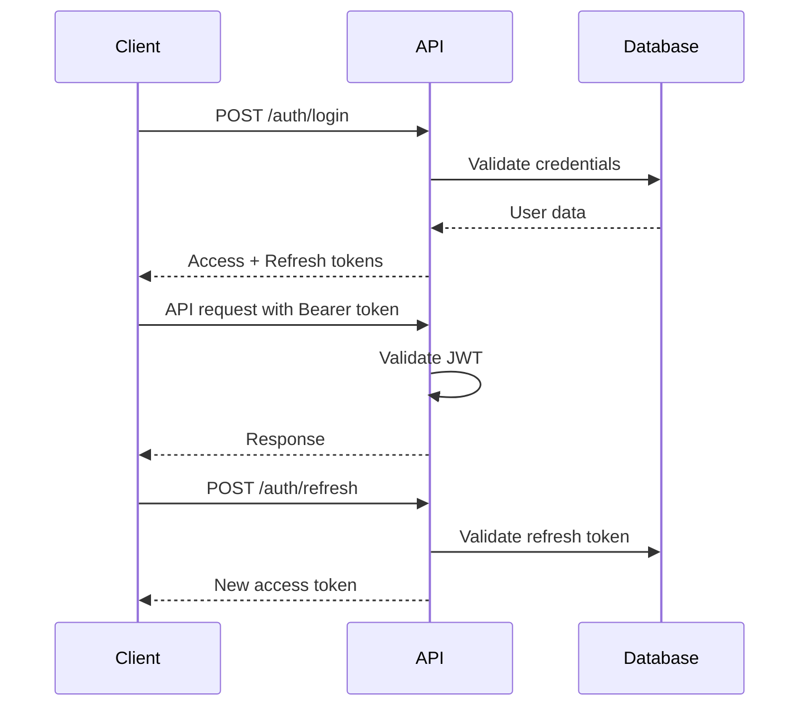

# Authentication

Posthoot uses JWT (JSON Web Tokens) for authentication. The API supports both traditional email/password authentication and Google OAuth integration.

## 🔐 Authentication Methods

### 1. Email/Password Authentication
Traditional authentication using email and password credentials.

### 2. Google OAuth
Authenticate users using Google OAuth ID tokens via Firebase.

### 3. API Keys
Generate API keys with granular permissions for programmatic access.

## 🎟️ Token Types

### Access Token
- **Lifetime**: 24 hours
- **Usage**: Include in `Authorization: Bearer <token>` header
- **Purpose**: Authenticate API requests

### Refresh Token
- **Lifetime**: 7 days
- **Usage**: Obtain new access tokens
- **Purpose**: Maintain session without re-authentication

## 🔄 Authentication Flow



## 📝 Request Headers

### Authorization Header
```http
Authorization: Bearer <access_token>
```

### API Key Header
```http
X-API-KEY: <api_key>
```

## 🔑 Token Structure

JWT tokens contain the following claims:

```json
{
  "sub": "user_id",
  "team_id": "team_id",
  "role": "ADMIN",
  "permissions": ["campaigns:read", "templates:write"],
  "exp": 1640995200,
  "iat": 1640908800
}
```

## 🔒 Security Features

### Password Security
- Bcrypt password hashing
- Minimum 8 character requirement
- Secure password reset flow

### Token Security
- Short-lived access tokens (24h)
- Refresh token rotation
- Secure token storage

### Rate Limiting
- Authentication endpoints are rate-limited
- Brute force protection
- Configurable limits per IP

## 🚨 Error Responses

### Invalid Token (401)
```json
{
  "error": "unauthorized",
  "message": "Invalid or expired token"
}
```

### Missing Token (401)
```json
{
  "error": "unauthorized",
  "message": "Authorization header required"
}
```

### Insufficient Permissions (403)
```json
{
  "error": "forbidden",
  "message": "Insufficient permissions for this resource"
}
```

## 🔄 Token Refresh

When your access token expires, use the refresh token to get a new one:

```bash
curl -X POST https://api.posthoot.com/auth/refresh \
  -H "Content-Type: application/json" \
  -d '{
    "refresh_token": "your_refresh_token"
  }'
```

## 🛡️ Best Practices

1. **Store tokens securely**
   - Never store tokens in localStorage
   - Use secure HTTP-only cookies
   - Implement token rotation

2. **Handle token expiration**
   - Monitor token expiration
   - Implement automatic refresh
   - Graceful error handling

3. **Use HTTPS**
   - Always use HTTPS in production
   - Never send tokens over HTTP

4. **Validate tokens**
   - Verify token signature
   - Check expiration time
   - Validate permissions

## 📚 Next Steps

- [Register User](/auth/register) - Create a new account
- [Login](/auth/login) - Authenticate with email/password
- [Google OAuth](/auth/google) - Authenticate with Google
- [Password Reset](/auth/password-reset) - Reset forgotten password
