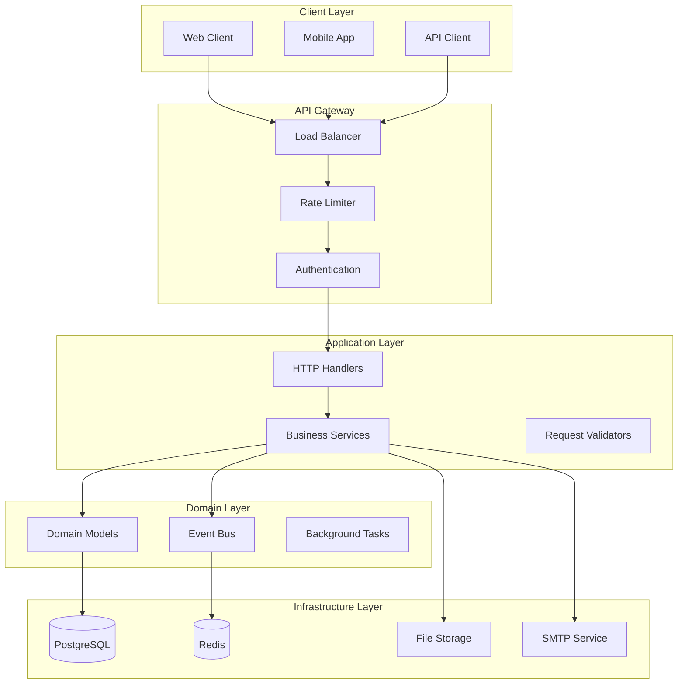
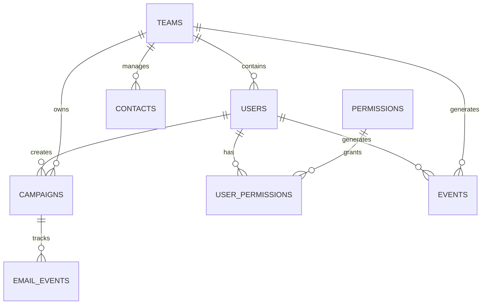
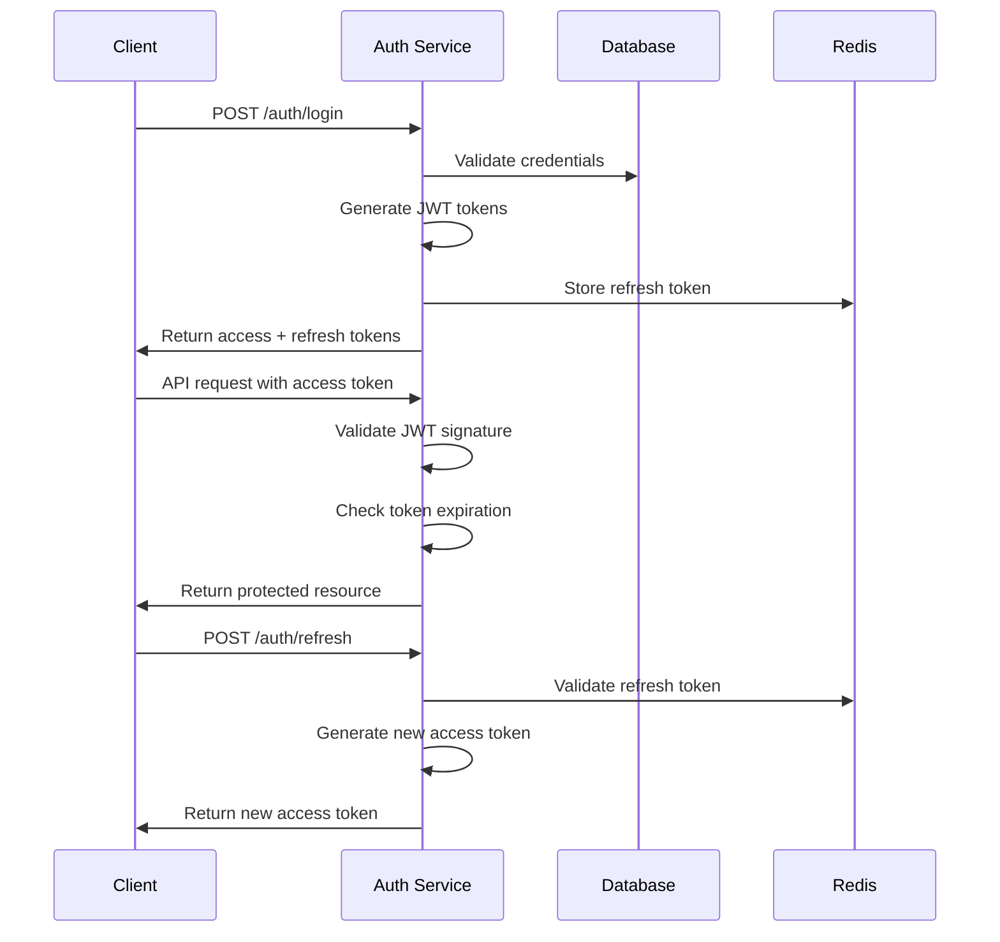
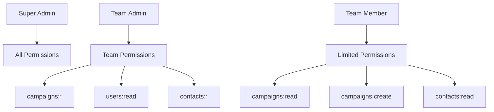
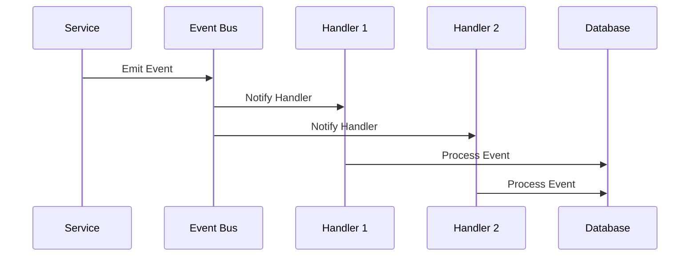
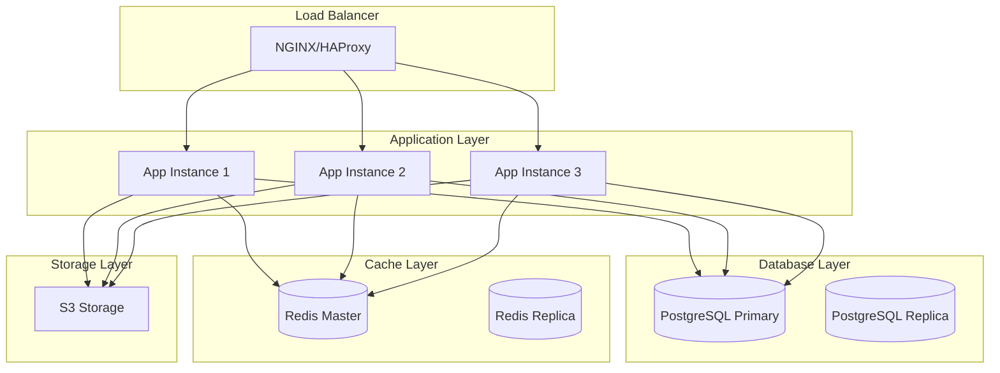

# Technical Details

This document provides a comprehensive overview of the technical architecture, implementation details, and design decisions behind the Posthoot backend.

## Table of Contents

- [Architecture Overview](#architecture-overview)
- [Technology Stack](#technology-stack)
- [Database Design](#database-design)
- [Authentication System](#authentication-system)
- [Permission System](#permission-system)
- [Event Bus System](#event-bus-system)
- [Rate Limiting](#rate-limiting)
- [Security Features](#security-features)
- [Performance Considerations](#performance-considerations)
- [Monitoring and Observability](#monitoring-and-observability)

## Architecture Overview

### High-Level Architecture

The Posthoot backend follows a layered architecture pattern with clear separation of concerns:



### Core Design Principles

1. **Separation of Concerns**: Each layer has a specific responsibility
2. **Dependency Inversion**: High-level modules don't depend on low-level modules
3. **Single Responsibility**: Each component has one reason to change
4. **Open/Closed Principle**: Open for extension, closed for modification
5. **Fail Fast**: Validate inputs early and fail gracefully

## Technology Stack

### Backend Framework

- **Echo v4**: High-performance HTTP framework for Go
- **GORM v2**: ORM for database operations
- **PostgreSQL**: Primary database
- **Redis**: Caching and session storage

### Key Libraries

```go
// Core dependencies
"github.com/labstack/echo/v4"           // HTTP framework
"gorm.io/gorm"                          // ORM
"gorm.io/driver/postgres"               // PostgreSQL driver
"github.com/redis/go-redis/v9"          // Redis client
"github.com/golang-jwt/jwt/v4"          // JWT handling
"golang.org/x/crypto/bcrypt"           // Password hashing
"golang.org/x/time/rate"               // Rate limiting

// Utilities
"github.com/go-playground/validator/v10" // Request validation
"github.com/google/uuid"                // UUID generation
"github.com/robfig/cron/v3"            // Cron jobs
"github.com/hibiken/asynq"             // Background tasks
```

### Development Tools

- **Swagger/OpenAPI**: API documentation
- **Docker**: Containerization
- **Make**: Build automation
- **GitHub Actions**: CI/CD

## Database Design

### Schema Overview

The database schema is designed for scalability and maintainability:

```sql
-- Core entities
CREATE TABLE users (
    id BIGSERIAL PRIMARY KEY,
    email VARCHAR(255) UNIQUE NOT NULL,
    password_hash VARCHAR(255) NOT NULL,
    first_name VARCHAR(100) NOT NULL,
    last_name VARCHAR(100) NOT NULL,
    role VARCHAR(20) NOT NULL DEFAULT 'member',
    team_id BIGINT REFERENCES teams(id),
    created_at TIMESTAMP DEFAULT CURRENT_TIMESTAMP,
    updated_at TIMESTAMP DEFAULT CURRENT_TIMESTAMP
);

CREATE TABLE teams (
    id BIGSERIAL PRIMARY KEY,
    name VARCHAR(255) NOT NULL,
    slug VARCHAR(255) UNIQUE NOT NULL,
    settings JSONB DEFAULT '{}',
    created_at TIMESTAMP DEFAULT CURRENT_TIMESTAMP,
    updated_at TIMESTAMP DEFAULT CURRENT_TIMESTAMP
);

CREATE TABLE campaigns (
    id BIGSERIAL PRIMARY KEY,
    name VARCHAR(255) NOT NULL,
    subject VARCHAR(255) NOT NULL,
    content TEXT NOT NULL,
    status VARCHAR(20) NOT NULL DEFAULT 'draft',
    team_id BIGINT NOT NULL REFERENCES teams(id),
    created_by BIGINT NOT NULL REFERENCES users(id),
    scheduled_at TIMESTAMP,
    sent_at TIMESTAMP,
    created_at TIMESTAMP DEFAULT CURRENT_TIMESTAMP,
    updated_at TIMESTAMP DEFAULT CURRENT_TIMESTAMP
);

CREATE TABLE contacts (
    id BIGSERIAL PRIMARY KEY,
    email VARCHAR(255) NOT NULL,
    first_name VARCHAR(100),
    last_name VARCHAR(100),
    team_id BIGINT NOT NULL REFERENCES teams(id),
    tags TEXT[],
    metadata JSONB DEFAULT '{}',
    created_at TIMESTAMP DEFAULT CURRENT_TIMESTAMP,
    updated_at TIMESTAMP DEFAULT CURRENT_TIMESTAMP
);

-- Permission system
CREATE TABLE permissions (
    id BIGSERIAL PRIMARY KEY,
    resource VARCHAR(100) NOT NULL,
    action VARCHAR(50) NOT NULL,
    created_at TIMESTAMP DEFAULT CURRENT_TIMESTAMP,
    UNIQUE(resource, action)
);

CREATE TABLE user_permissions (
    id BIGSERIAL PRIMARY KEY,
    user_id BIGINT NOT NULL REFERENCES users(id),
    permission_id BIGINT NOT NULL REFERENCES permissions(id),
    granted BOOLEAN NOT NULL DEFAULT true,
    created_at TIMESTAMP DEFAULT CURRENT_TIMESTAMP,
    UNIQUE(user_id, permission_id)
);

-- Event tracking
CREATE TABLE events (
    id BIGSERIAL PRIMARY KEY,
    event_type VARCHAR(100) NOT NULL,
    user_id BIGINT REFERENCES users(id),
    team_id BIGINT REFERENCES teams(id),
    data JSONB NOT NULL,
    created_at TIMESTAMP DEFAULT CURRENT_TIMESTAMP
);

-- Email tracking
CREATE TABLE email_events (
    id BIGSERIAL PRIMARY KEY,
    email_id VARCHAR(255) NOT NULL,
    campaign_id BIGINT REFERENCES campaigns(id),
    event_type VARCHAR(50) NOT NULL, -- 'sent', 'opened', 'clicked'
    recipient_email VARCHAR(255) NOT NULL,
    metadata JSONB DEFAULT '{}',
    created_at TIMESTAMP DEFAULT CURRENT_TIMESTAMP
);
```

### Indexing Strategy

```sql
-- Performance indexes
CREATE INDEX idx_users_email ON users(email);
CREATE INDEX idx_users_team_id ON users(team_id);
CREATE INDEX idx_campaigns_team_id ON campaigns(team_id);
CREATE INDEX idx_campaigns_status ON campaigns(status);
CREATE INDEX idx_campaigns_scheduled_at ON campaigns(scheduled_at);
CREATE INDEX idx_contacts_team_id ON contacts(team_id);
CREATE INDEX idx_contacts_email ON contacts(email);
CREATE INDEX idx_events_created_at ON events(created_at);
CREATE INDEX idx_email_events_email_id ON email_events(email_id);
CREATE INDEX idx_email_events_campaign_id ON email_events(campaign_id);

-- Composite indexes for common queries
CREATE INDEX idx_campaigns_team_status ON campaigns(team_id, status);
CREATE INDEX idx_contacts_team_email ON contacts(team_id, email);
```

### Data Relationships



## Authentication System

### JWT Token Structure

```go
type Claims struct {
    UserID   uint     `json:"user_id"`
    Email    string   `json:"email"`
    TeamID   uint     `json:"team_id"`
    Role     string   `json:"role"`
    Permissions []string `json:"permissions"`
    jwt.RegisteredClaims
}
```

### Token Lifecycle



### Security Measures

1. **Token Expiration**: Access tokens expire in 24 hours
2. **Refresh Token Rotation**: New refresh token on each refresh
3. **Token Blacklisting**: Invalidated tokens stored in Redis
4. **Rate Limiting**: Login attempts limited per IP
5. **Password Hashing**: Bcrypt with cost factor 12

## Permission System

### Permission Structure

```go
type Permission struct {
    Resource string `json:"resource"` // e.g., "campaigns", "users"
    Action   string `json:"action"`   // e.g., "create", "read", "update", "delete"
}

type PermissionChecker struct {
    db *gorm.DB
}

func (pc *PermissionChecker) HasPermission(userID uint, resource, action string) bool {
    // Check user-specific permissions
    // Check role-based permissions
    // Check wildcard permissions
}
```

### Permission Hierarchy



### Wildcard Permissions

```go
// Examples of wildcard permissions
"campaigns:*"     // All campaign operations
"users:read"      // Read user data
"*:create"        // Create any resource
"*:*"            // All permissions (super admin)
```

## Event Bus System

### Event Structure

```go
type Event struct {
    ID        string                 `json:"id"`
    Type      string                 `json:"type"`
    Data      map[string]interface{} `json:"data"`
    UserID    *uint                  `json:"user_id,omitempty"`
    TeamID    *uint                  `json:"team_id,omitempty"`
    Timestamp time.Time              `json:"timestamp"`
}

type EventBus struct {
    handlers map[string][]EventHandler
    mu       sync.RWMutex
}

type EventHandler func(Event) error
```

### Event Flow



### Event Types

| Event Type | Description | Payload |
|------------|-------------|---------|
| `user.created` | New user registration | `{"user_id": 123, "email": "..."}` |
| `campaign.sent` | Campaign sent | `{"campaign_id": 456, "recipient_count": 1000}` |
| `email.opened` | Email opened | `{"email_id": "uuid", "campaign_id": 456}` |
| `email.clicked` | Email link clicked | `{"email_id": "uuid", "url": "..."}` |
| `team.invited` | Team invitation sent | `{"team_id": 789, "invitee_email": "..."}` |

## Rate Limiting

### Implementation Details

The rate limiting system uses Redis for distributed rate limiting:

```go
type RateLimitConfig struct {
    RedisClient    *redis.Client
    DefaultLimit   rate.Limit
    DefaultBurst   int
    EndpointLimits map[string]EndpointLimit
}

type EndpointLimit struct {
    Limit  rate.Limit
    Burst  int
    Window time.Duration
}
```

### Rate Limit Headers

```http
X-RateLimit-Limit: 100
X-RateLimit-Remaining: 95
X-RateLimit-Reset: 1640995200
```

### Default Limits

| Endpoint | Limit | Window | Burst |
|----------|-------|--------|-------|
| Authentication | 5/min | 1 minute | 3 |
| Registration | 3/hour | 1 hour | 1 |
| API (general) | 100/min | 1 minute | 50 |
| Email sending | 50/min | 1 minute | 25 |
| File upload | 20/min | 1 minute | 10 |
| Tracking | 1000/min | 1 minute | 500 |

## Security Features

### Input Validation

```go
type CreateUserRequest struct {
    Email     string `json:"email" validate:"required,email"`
    Password  string `json:"password" validate:"required,min=8"`
    FirstName string `json:"first_name" validate:"required,min=1,max=100"`
    LastName  string `json:"last_name" validate:"required,min=1,max=100"`
}

func (h *UserHandler) CreateUser(c echo.Context) error {
    req := &CreateUserRequest{}
    if err := c.Bind(req); err != nil {
        return echo.NewHTTPError(http.StatusBadRequest, "invalid request")
    }
    
    if err := h.validator.Struct(req); err != nil {
        return echo.NewHTTPError(http.StatusBadRequest, "validation failed")
    }
    // Process request...
}
```

### SQL Injection Prevention

- **Parameterized Queries**: All database queries use prepared statements
- **Input Sanitization**: All user inputs are validated and sanitized
- **ORM Protection**: GORM automatically escapes SQL values

### XSS Prevention

- **Content Security Policy**: Strict CSP headers
- **Input Encoding**: All user inputs are properly encoded
- **Output Sanitization**: HTML content is sanitized before storage

### CSRF Protection

```go
// CSRF token validation middleware
func CSRFMiddleware() echo.MiddlewareFunc {
    return func(next echo.HandlerFunc) echo.HandlerFunc {
        return func(c echo.Context) error {
            if c.Request().Method == "GET" {
                return next(c)
            }
            
            token := c.Request().Header.Get("X-CSRF-Token")
            if !validateCSRFToken(token) {
                return echo.NewHTTPError(http.StatusForbidden, "invalid CSRF token")
            }
            
            return next(c)
        }
    }
}
```

## Performance Considerations

### Database Optimization

1. **Connection Pooling**: Configured connection pool for optimal performance
2. **Query Optimization**: Use database indexes and optimized queries
3. **Caching Strategy**: Redis caching for frequently accessed data
4. **Database Partitioning**: Large tables partitioned by date

### Caching Strategy

```go
type CacheManager struct {
    redis *redis.Client
}

func (cm *CacheManager) GetUser(userID uint) (*User, error) {
    key := fmt.Sprintf("user:%d", userID)
    
    // Try cache first
    if cached, err := cm.redis.Get(ctx, key).Result(); err == nil {
        var user User
        json.Unmarshal([]byte(cached), &user)
        return &user, nil
    }
    
    // Fallback to database
    user, err := cm.db.GetUser(userID)
    if err != nil {
        return nil, err
    }
    
    // Cache for 1 hour
    data, _ := json.Marshal(user)
    cm.redis.Set(ctx, key, data, time.Hour)
    
    return user, nil
}
```

### Background Processing

```go
type EmailTask struct {
    CampaignID uint   `json:"campaign_id"`
    Recipients []string `json:"recipients"`
}

func (h *EmailHandler) SendCampaign(c echo.Context) error {
    // Create background task
    task := &EmailTask{
        CampaignID: campaign.ID,
        Recipients: recipients,
    }
    
    // Queue for background processing
    h.taskQueue.Enqueue("send_campaign", task)
    
    return c.JSON(http.StatusAccepted, map[string]string{
        "message": "Campaign queued for sending",
        "task_id": taskID,
    })
}
```

## Monitoring and Observability

### Logging Strategy

```go
type Logger struct {
    level   string
    service string
}

func (l *Logger) Info(msg string, fields ...Field) {
    log.Info(msg, append(fields, 
        String("service", l.service),
        String("level", "info"),
        Time("timestamp", time.Now()),
    )...)
}

func (l *Logger) Error(msg string, err error, fields ...Field) {
    log.Error(msg, append(fields,
        String("service", l.service),
        String("level", "error"),
        String("error", err.Error()),
        Time("timestamp", time.Now()),
    )...)
}
```

### Metrics Collection

```go
type Metrics struct {
    RequestCount   *prometheus.CounterVec
    RequestDuration *prometheus.HistogramVec
    ErrorCount     *prometheus.CounterVec
    ActiveUsers    prometheus.Gauge
}

func (m *Metrics) RecordRequest(method, path string, status int, duration time.Duration) {
    m.RequestCount.WithLabelValues(method, path, strconv.Itoa(status)).Inc()
    m.RequestDuration.WithLabelValues(method, path).Observe(duration.Seconds())
}
```

### Health Checks

```go
func (s *Server) HealthCheck(c echo.Context) error {
    checks := map[string]interface{}{
        "database": s.checkDatabase(),
        "redis":    s.checkRedis(),
        "storage":  s.checkStorage(),
    }
    
    allHealthy := true
    for _, status := range checks {
        if status != "healthy" {
            allHealthy = false
        }
    }
    
    statusCode := http.StatusOK
    if !allHealthy {
        statusCode = http.StatusServiceUnavailable
    }
    
    return c.JSON(statusCode, map[string]interface{}{
        "status":  "healthy",
        "checks":  checks,
        "version": "1.0.0",
        "time":    time.Now().Format(time.RFC3339),
    })
}
```

### Tracing

```go
func TracingMiddleware() echo.MiddlewareFunc {
    return func(next echo.HandlerFunc) echo.HandlerFunc {
        return func(c echo.Context) error {
            ctx := c.Request().Context()
            
            // Extract trace ID from headers
            if traceID := c.Request().Header.Get("X-Trace-ID"); traceID != "" {
                ctx = context.WithValue(ctx, "trace_id", traceID)
            }
            
            // Add trace ID to response
            c.Response().Header().Set("X-Trace-ID", traceID)
            
            return next(c)
        }
    }
}
```

## Deployment Architecture

### Production Environment



### Scaling Strategy

1. **Horizontal Scaling**: Multiple application instances behind load balancer
2. **Database Scaling**: Read replicas for read-heavy operations
3. **Cache Scaling**: Redis cluster for high availability
4. **Storage Scaling**: S3-compatible storage for file storage

### Disaster Recovery

1. **Database Backups**: Automated daily backups with point-in-time recovery
2. **Application Backups**: Configuration and code backups
3. **Monitoring**: Comprehensive monitoring and alerting
4. **Failover**: Automated failover procedures

This technical architecture provides a solid foundation for building a scalable, secure, and maintainable email campaign management system.
