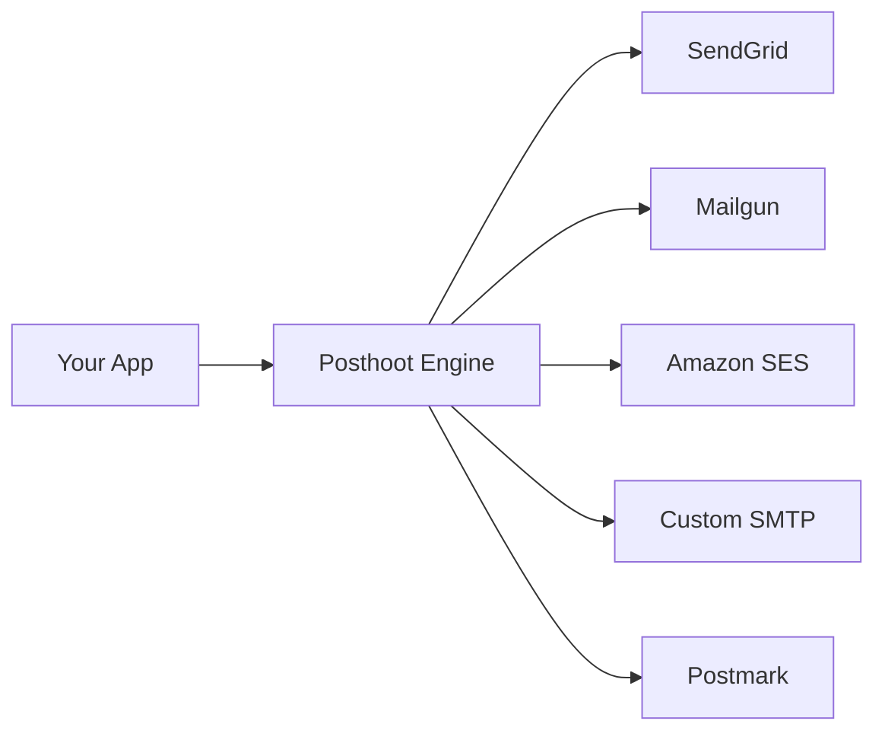
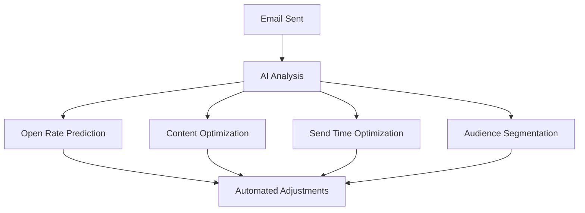
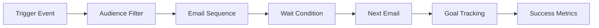

# Vision

## Why we're building this

We're tired of the same old email marketing platforms. You know the ones - they lock you in, charge you a fortune, and give you zero control over what's actually happening with your emails.

Posthoot is our answer to that problem. We're building an open-source email marketing engine that puts you back in control. No more vendor lock-in, no more black-box algorithms, and definitely no more surprise bills.

## The problem with email marketing today

Here's what sucks about current email marketing platforms:

- **You're locked in** - Once you're using Mailchimp or SendGrid, switching is painful and expensive
- **You can't see what's happening** - Black-box algorithms decide when to send your emails, and you have no idea why
- **APIs are rigid** - Want to do something custom? Good luck with that
- **It's expensive** - Enterprise plans cost thousands for features you don't even need
- **No real AI** - They claim to have AI, but it's mostly marketing BS

### What we're building instead

Posthoot is an open-source email marketing engine that gives you actual control. You own the code, you control the data, and you decide how everything works.

## What makes Posthoot different

### 1. **Multiple SMTP providers**
Don't put all your eggs in one basket. Connect to SendGrid, Mailgun, Amazon SES, or any other provider. If one goes down, your emails keep flowing.

**Why this matters:**
- **Save money** - Route emails through the cheapest provider
- **Stay reliable** - Automatic failover if one provider has issues
- **Stay flexible** - Use different providers for different types of emails
- **Stay transparent** - See exactly what's happening with your emails

### 2. **Template control**
No more fighting with WYSIWYG editors. Write your templates in HTML/CSS, use our templating engine for dynamic content, and preview exactly how they'll look.

- **Full design freedom** - Write your own HTML/CSS
- **Dynamic content** - Personalize emails in real-time
- **A/B testing** - Built-in testing framework
- **Mobile-first** - Responsive design out of the box
- **Live preview** - See exactly how emails will look

### 3. **Real AI (not marketing BS)**
We're building actual AI features that help you send better emails:

**What we're working on:**
- **Predict which subject lines will work better**
- **Suggest the best time to send emails**
- **Automatically segment your audience based on behavior**
- **Optimize content based on what actually works**
- **Run A/B tests and learn from the results**

### 4. **Campaigns that run themselves**
Set up your email campaigns and let them run on autopilot:

**Automation features:**
- **Multi-step sequences** - Complex email workflows
- **Behavioral triggers** - Send emails based on what users do
- **Goal tracking** - Track conversions and engagement
- **Smart limits** - Prevent email fatigue automatically
- **Performance optimization** - Continuously improve campaigns

## How we're building this

### Open source first
- **You can see everything** - No black boxes, no hidden code
- **You can change anything** - Modify any part of the system
- **Built by developers, for developers** - We know what you need
- **Actually affordable** - No hidden fees or vendor lock-in

### Developer experience matters
- **RESTful APIs** - Every feature is available via API
- **Easy integration** - SDKs for popular languages
- **Real-time analytics** - See what's happening right now
- **Self-hosted option** - Keep your data under your control

### Enterprise ready
- **Security first** - Enterprise-grade security features
- **Scalable** - Handle millions of emails without breaking
- **High availability** - 99.9% uptime guarantee
- **Compliant** - GDPR, CAN-SPAM, and more

## How we compare

### vs. Traditional platforms (Mailchimp, SendGrid, etc.)

| Feature | Traditional Platforms | Posthoot |
|---------|---------------------|----------|
| **Vendor lock-in** | ❌ High | ✅ None |
| **Transparency** | ❌ Limited | ✅ Complete |
| **Customization** | ❌ Basic | ✅ Unlimited |
| **AI integration** | ❌ Limited | ✅ Advanced |
| **Cost** | ❌ Expensive | ✅ Affordable |
| **Control** | ❌ Minimal | ✅ Complete |

### vs. Other open source solutions

| Feature | Other OSS | Posthoot |
|---------|-----------|----------|
| **Multi-provider** | ❌ Single | ✅ Multiple |
| **AI capabilities** | ❌ Basic | ✅ Advanced |
| **Automation** | ❌ Simple | ✅ Complex |
| **Analytics** | ❌ Basic | ✅ Advanced |
| **Developer UX** | ❌ Complex | ✅ Simple |

## What's coming next

### Phase 1: Core engine ✅
- [x] Multi-provider SMTP support
- [x] Template management system
- [x] Basic analytics and tracking
- [x] RESTful API

### Phase 2: AI integration 🚧
- [ ] Predictive analytics
- [ ] Content optimization
- [ ] Smart segmentation
- [ ] Automated A/B testing

### Phase 3: Advanced automation 🔮
- [ ] Complex workflow builder
- [ ] Behavioral triggers
- [ ] Goal-based optimization
- [ ] Multi-channel integration

### Phase 4: Enterprise features 🔮
- [ ] Advanced security features
- [ ] Compliance tools
- [ ] White-label solutions
- [ ] Enterprise integrations

## Want to help?

We're building Posthoot because we believe email marketing should be:

- **Open and transparent** - You should see exactly what's happening
- **Fully customizable** - You should be able to change anything
- **Intelligent and automated** - Real AI, not marketing BS
- **Cost-effective** - No hidden fees or vendor lock-in
- **Developer-friendly** - Built by developers, for developers

Whether you're a developer building email features, a marketer tired of vendor lock-in, or an enterprise looking for complete control - Posthoot is for you.

**Ready to take control of your email marketing?** [Get started today](/guides/quickstart) or [contribute to the project](https://github.com/posthoot/mail).

---

*"Email marketing should be a tool that serves your business, not a service that controls it."*
