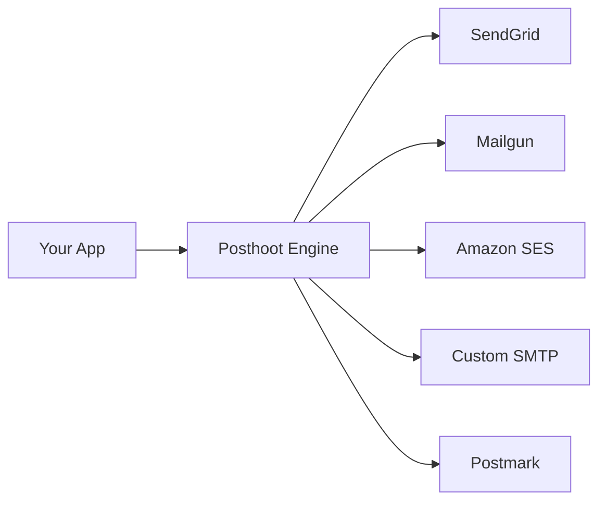
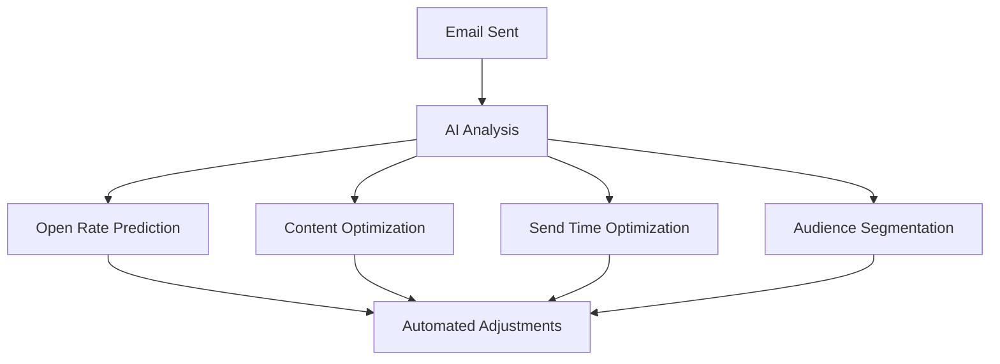
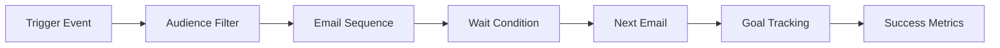

# Vision

## 🎯 Our Mission

Posthoot was built with a simple yet powerful vision: **to give businesses complete control over their email marketing infrastructure**. We believe that email marketing should be transparent, customizable, and intelligent - not locked behind proprietary systems with limited flexibility.

## 🚀 Why We Built Posthoot

### The Problem We're Solving

Traditional email marketing platforms have several critical limitations:

- **🔒 Vendor Lock-in**: Once you're in, it's expensive and complex to switch
- **📊 Limited Transparency**: Black-box algorithms that you can't understand or modify
- **🔧 Inflexible APIs**: Rigid integrations that don't adapt to your unique needs
- **💰 High Costs**: Expensive enterprise plans for features you might not need
- **🤖 No AI Integration**: Limited or no AI capabilities for automation and optimization

### Our Solution

Posthoot is an **open-source email marketing engine** that puts you in control:

## 🎯 Core Vision Pillars

### 1. **🔌 Multi-Provider SMTP Engine**
Connect to any SMTP provider without vendor lock-in:

**Benefits:**
- **Cost Optimization**: Route emails through the cheapest provider
- **Reliability**: Failover between multiple providers
- **Flexibility**: Use different providers for different use cases
- **Transparency**: See exactly what's happening with your emails

### 2. **🎨 Template Control & Customization**
Complete control over your email templates:

- **🔧 Custom HTML/CSS**: Full design freedom
- **📝 Dynamic Content**: Real-time personalization
- **🎯 A/B Testing**: Built-in testing framework
- **📱 Responsive Design**: Mobile-first approach
- **🔍 Preview System**: See exactly how emails will look

### 3. **🤖 AI-Powered Workflows**
Bring artificial intelligence into your email marketing:

**AI Capabilities:**
- **📈 Predictive Analytics**: Forecast campaign performance
- **🎯 Smart Segmentation**: AI-driven audience targeting
- **⏰ Optimal Timing**: Best send time recommendations
- **📝 Content Optimization**: Subject line and content suggestions
- **🔄 Automated A/B Testing**: Continuous optimization

### 4. **🚀 Marketing Campaign Automation**
Set up campaigns that run on autopilot:

**Automation Features:**
- **🔄 Multi-Step Sequences**: Complex email workflows
- **🎯 Behavioral Triggers**: Action-based automation
- **📊 Goal Tracking**: Conversion and engagement metrics
- **🛡️ Smart Limits**: Prevent email fatigue
- **📈 Performance Optimization**: Continuous improvement

## 🏗️ Architecture Philosophy

### Open Source First
- **🔓 Full Transparency**: See exactly how everything works
- **🔧 Customizable**: Modify any part of the system
- **🤝 Community Driven**: Built by developers, for developers
- **💰 Cost Effective**: No hidden fees or vendor lock-in

### Developer Experience
- **📚 Comprehensive APIs**: RESTful APIs for every feature
- **🔌 Easy Integration**: SDKs for popular languages
- **📊 Real-time Analytics**: Live performance monitoring
- **🛠️ Self-Hosted Option**: Complete control over your data

### Enterprise Ready
- **🔒 Security First**: Enterprise-grade security features
- **📈 Scalable**: Handle millions of emails
- **🔄 High Availability**: 99.9% uptime guarantee
- **📊 Compliance**: GDPR, CAN-SPAM, and more

## 🎯 What Makes Posthoot Different

### vs. Traditional Email Platforms

| Feature | Traditional Platforms | Posthoot |
|---------|---------------------|----------|
| **Vendor Lock-in** | ❌ High | ✅ None |
| **Transparency** | ❌ Limited | ✅ Complete |
| **Customization** | ❌ Basic | ✅ Unlimited |
| **AI Integration** | ❌ Limited | ✅ Advanced |
| **Cost** | ❌ Expensive | ✅ Affordable |
| **Control** | ❌ Minimal | ✅ Complete |

### vs. Other Open Source Solutions

| Feature | Other OSS | Posthoot |
|---------|-----------|----------|
| **Multi-Provider** | ❌ Single | ✅ Multiple |
| **AI Capabilities** | ❌ Basic | ✅ Advanced |
| **Automation** | ❌ Simple | ✅ Complex |
| **Analytics** | ❌ Basic | ✅ Advanced |
| **Developer UX** | ❌ Complex | ✅ Simple |

## 🚀 Our Roadmap

### Phase 1: Core Engine ✅
- [x] Multi-provider SMTP support
- [x] Template management system
- [x] Basic analytics and tracking
- [x] RESTful API

### Phase 2: AI Integration 🚧
- [ ] Predictive analytics
- [ ] Content optimization
- [ ] Smart segmentation
- [ ] Automated A/B testing

### Phase 3: Advanced Automation 🔮
- [ ] Complex workflow builder
- [ ] Behavioral triggers
- [ ] Goal-based optimization
- [ ] Multi-channel integration

### Phase 4: Enterprise Features 🔮
- [ ] Advanced security features
- [ ] Compliance tools
- [ ] White-label solutions
- [ ] Enterprise integrations

## 🤝 Join Our Vision

We're building Posthoot because we believe email marketing should be:

- **🔓 Open and transparent**
- **🔧 Fully customizable**
- **🤖 Intelligent and automated**
- **💰 Cost-effective**
- **🚀 Developer-friendly**

Whether you're a developer building email features, a marketer tired of vendor lock-in, or an enterprise looking for complete control - Posthoot is for you.

**Ready to take control of your email marketing?** [Get started today](/guides/quickstart) or [contribute to the project](https://github.com/posthoot/mail).

---

*"Email marketing should be a tool that serves your business, not a service that controls it."*
